# Graphical User Interface

[TOC]

*La interfaz de usuario de su aplicación es todo lo que el usuario puede ver e interactuar.*

Android proporciona una variedad de componentes de IU precompilados, como objetos de diseño estructurado y controles de IU que le permiten construir la interfaz gráfica de usuario para su aplicación. 

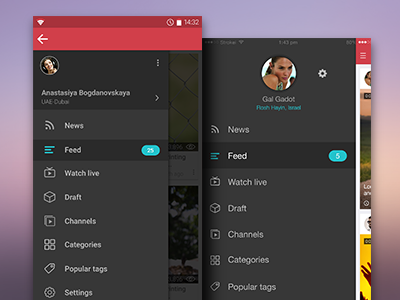

## Layouts

Un `layout` define la estructura de una interfaz de usuario en su aplicación, como en una actividad. Todos los elementos en el diseño se construyen utilizando una jerarquía.


Tenemos dos componentes principales

* `ViewGroup` es un contenedor invisible que define la estructura de diseño para View y otros objetos ViewGroup.
* `View` generalmente dibuja algo que el usuario puede ver e interactuar con él. Los `View` son también conocidos como **widgets** y pueden ser de muchas subclases como por ejemplo `Button`, `TextView`, etc.

### ¿Cómo crear mi layout?

Básicamente podemos contruir un *layout* de tres maneras distintas.

* **Inicializar elementos de layout en tiempo de ejecución**. Basta con crear objectos e tipo View o GroupView en el código Kotlin.
* **Usar el *Layout Editor* de Android Studio**. Arrastrar los componentes y acomodarlos con ayuda del editor de android.
* **Declarar los elementos UI en un archivo XML**.  Crear un archivo XML y contruir la vista de la aplicación como si se tratase de un diseño web.

### ¿Cómo funcionan los recursos XML?

Cuando compilamos la aplicación, cada archivo XML se convierte en un recurso `View`. Y para que esta vista funcione o sea visible al usuario debemos de cargarla en la sección de código de nuestra aplicación, concretamente en el método `Activity.onCreate()`.

### Cargar recurso XML layout

He aquí una manera de carga un layout.

```kotlin
fun onCreate(savedInstanceState: Bundle) {
    super.onCreate(savedInstanceState)
    setContentView(R.layout.main_layout)
}
```

El método de tipo *callback()* llamado `onCreate()` es llamado por el Framework de Android cuando la actividad es iniciada.

### Familiarizandose con los XML layouts

#### ¿Qué es XML?

#### El layout más simple

Observemos el siguiente snippet para crear un layout sencillo.

```xml
<?xml version="1.0" encoding="utf-8"?>
<LinearLayout xmlns:android="http://schemas.android.com/apk/res/android"
              android:layout_width="match_parent"
              android:layout_height="match_parent"
              android:orientation="vertical" >
    <TextView android:id="@+id/text"
              android:layout_width="wrap_content"
              android:layout_height="wrap_content"
              android:text="Hello, I am a TextView" />
    <Button android:id="@+id/button"
            android:layout_width="wrap_content"
            android:layout_height="wrap_content"
            android:text="Hello, I am a Button" />
</LinearLayout>
```

#### Atributos

Cada objecto de tipo View (widget) o ViewGroup  tiene ciertos atributos que son propios de él, aunque algunos otros son compartidos ya que probablemente los heredaron de una misma *clase*.

#### ID

Cualquier objeto de Vista puede tener un ID asociado, para identificar de forma única la Vista dentro del árbol. Cuando se compila la aplicación, se hace referencia a este ID como un entero.

El ID se suele asignar en el archivo XML de diseño como una cadena. La sintaxis para poner un *id* es la siguiente

```xml
android:id="@+id/my_button"
```

* El simbolo arroba (@) indica que el "analizador XML" (XML parser) debe expandir el resto del ID e identificarlo como un recurso ID.
* El símbolo más (+) significa que este es un nuevo nombre de recurso que se debe crear y agregar a nuestros recursos (en el archivo R.java).

##### Consideraciones de los ID

La definición de ID para los objetos de vista es importante al crear un RelativeLayout. En un diseño relativo, las vistas de hermanos pueden definir su diseño en relación con otra vista de hermanos, a la que se hace referencia mediante el ID único.

Una ID no necesita ser única en todo el árbol, pero debe ser única en la parte del árbol que está buscando (que a menudo puede ser todo el árbol, por lo que es mejor ser completamente único cuando sea posible).

#### Parámetros de un Layout

Los layout se pueden personalizar con los atributos y estos atributos reciben ciertos parametros. Por ejemplo, podemos utilizar el atributo `layout_width` y pasarle alguna de las dos opciones siguientes :

* `wrap content` le dice a su vista que se ajuste a las dimensiones requeridas por su contenido.
* `match parent` le dice a su vista que sea tan grande como lo permita su grupo de vista principal.

*Cabe destacar que `layout_width` es también un atributo de los widgets.*

##### Posición de un Layout

Una vista tiene una ubicación, expresada como un par de coordenadas; izquierda y superior, y dos dimensiones, expresadas como un ancho y una altura. 

*La unidad de ubicación y dimensiones es el píxel.*

##### Tamaño

El tamaño de una vista se expresa con un ancho y una altura. Una vista en realidad posee dos pares de valores de ancho y alto.

* El primer par se conoce como *ancho medido* y *altura medida*. Estas dimensiones definen qué tan grande quiere ser una vista dentro de su padre.

* El segundo par se conoce simplemente como ancho y alto, o a veces ancho de dibujo y alto de dibujo. Estas dimensiones definen el tamaño real de la vista en pantalla.

##### Padding

El *padding* se expresa en píxeles para las partes izquierda, superior, derecha e inferior de la vista. El *padding* se puede utilizar para compensar el contenido de la vista en un número específico de píxeles. Por ejemplo, un relleno izquierdo de 2 empujará el contenido de la vista 2 píxeles a la derecha del borde izquierdo.

##### Marging

Los margin son para los widgets ya que los Layout no tienen esta propiedad.

## Construyendo Layouts

## FrameLayout

Un FrameLayout es un view group creado para mostrar un solo elemento en pantalla.

Sin embargo puedes añadir varios hijos con el fin de superponerlos, donde el ultimo hijo agregado, es el que se muestra en la parte superior y el resto se pone por debajo en forma de pila.

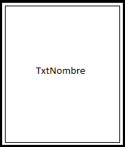

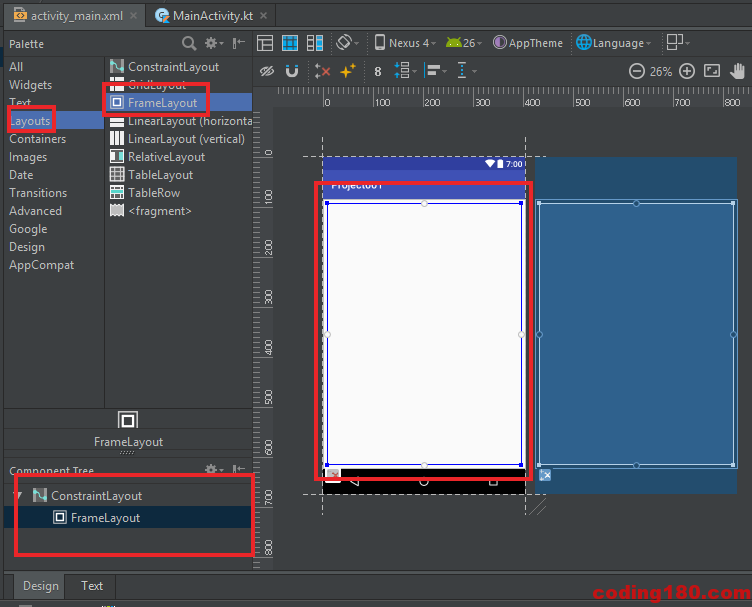

Sobreponiendo objetos en un **Framelayout**

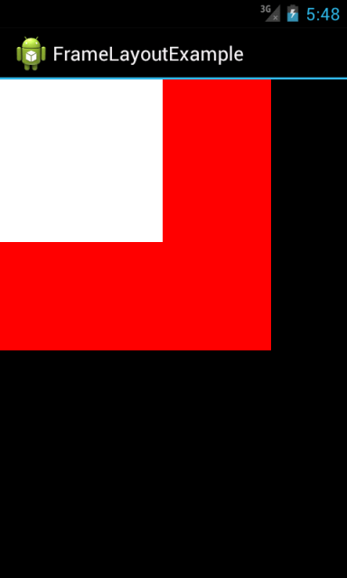

Para alinear cada elemento dentro del `FrameLayout` usa el  parámetro `android:layout_gravity`

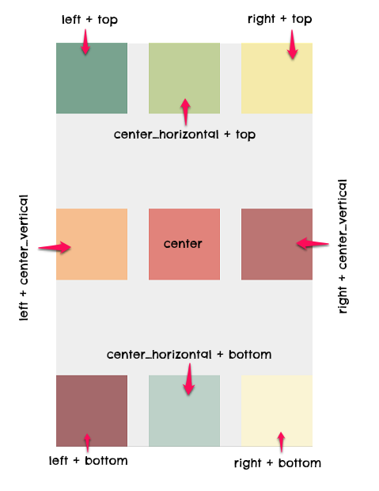

El parámetro `gravitiy` se basa en las posiciones comunes de un view dentro del layout. Se describe con constantes de orientación:

- `top`: Indica la parte superior del layout.
- `left`: Indica la parte izquierda del layout.
- `right`: Se refiere a la parte derecha del layout.
- `bottom`: Representa el límite inferior del layout.
- `center_horizontal`: Centro horizontal del layout.
- `center_vertical`: Alineación al centro vertical del layout.
- `center`: Es la combinación de `center_horizontal` y `center_vertical`.

Como se muestra en la ilustración, es posible crear variaciones combinadas, como por ejemplo **right + bottom**. En código esta combinación puedes representarla con un **OR inclusivo**.

```xml
android:layout_gravity="right|bottom"
```

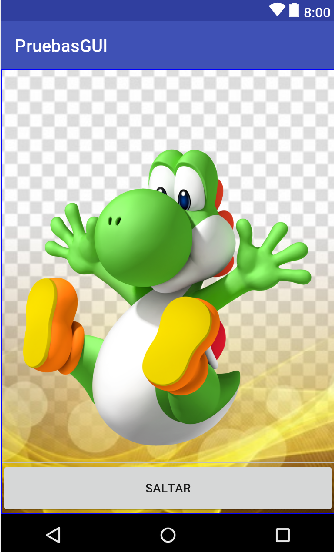

## Linear Layout

Es un *layout* que organiza a sus hijos en una sola fila horizontal o vertical. Crea una barra de desplazamiento si la longitud de la ventana supera la longitud de la pantalla.

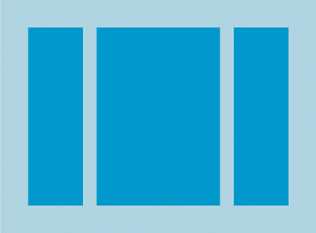

Todos los campos secundarios de un `LinearLayout` se apilan uno detrás de otro, por cual una lista vertical solo tendrá un campo secundario por fila, independientemente del ancho que tengan, y una lista horizontal solo tendrá la altura de una fila (la altura del campo secundario más alto, más el relleno). Un `LinearLayout` respeta los *márgenes* entre los campos secundarios y la *gravedad* (alineación a la derecha, centrada o a la izquierda) de cada campo secundario.

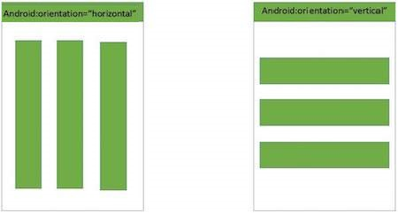

Ejemplo de un formulario para corro usando una distribución linearlayout.

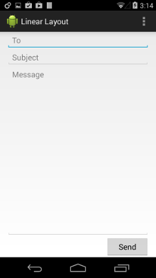


## RelativeLayout

El relative layout es uno de los elementos más flexible y elaborado de todos los view. El RelativeLayout permite alinear cada hijo con referencias subjetivas de cada hermano.Con el RelativeLayout pensaremos en como alinear los bordes de cada view con otros. 

*Imagina en una sentencia como “el botón estará por debajo del texto” o “la imagen se encuentra a la derecha de la descripción”.*

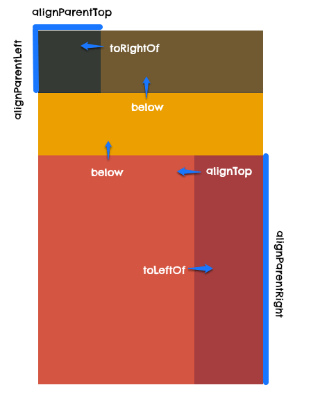

Veamos algunos de los [parámetros del RelativeLayout ](http://developer.android.com/intl/es/reference/android/widget/RelativeLayout.LayoutParams.html)para definir posiciones:

- `android:layout_above`: Posiciona el borde inferior del elemento actual con el borde superior del view referenciado con el id indicado.
- `android:layout_centerHorizontal`: Usa true para indicar que el view será centrado horizontalmente con respecto al padre.
- `android:layout_alignParentBottom`: Usa true para alinear el borde inferior de este view con el borde inferior del padre.
- `android:layout_alignStart`: Alinea el borde inicial de este elemento con el borde inicial del view referido por `id`.

## TableLayout

Como su nombre lo indica el tablelayout organiza views en filas y columnas de forma tabular.

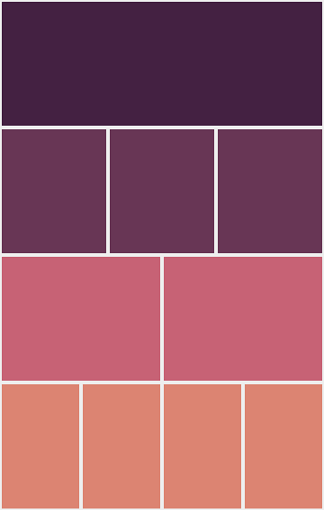

Para crear las filas se usa el componente `TableRow` dentro del `TableLayout`. Cada celda es declarada como un view de cualquier tipo (imagen, texto, otro group view, etc.) dentro de la fila. Sin embargo, puedes crear una celda con otro tipo de view. Esto hará que todo el espacio de la fila sea ocupado por el objeto.

El `TableRow` trae consigo un parámetro llamado `android:layout_column` para asignar la columna a la que pertenece cada celda en su interior. Incluso puedes usar el parámetro `weight` para declarar pesos de las celdas.

## Grid Layout

Un [GridLayout](http://developer.android.com/intl/es/reference/android/widget/GridLayout.html) es un `ViewGroup` que alinea sus elementos hijos en una cuadrícula (grilla ó grid). Nace con el fin de evitar anidar linear layouts para crear diseños complejos.

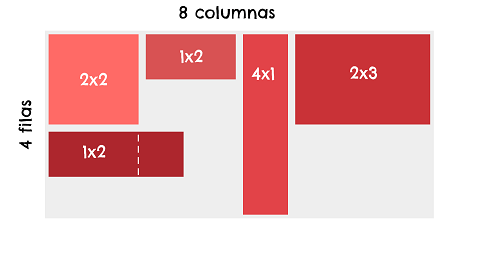

Los atributos más importantes del GridLayout son:

- `columnCount`: Cantidad de columnas que tendrá la grilla.
- `rowCount`: Cantidad de filas de la cuadrícula.
- `useDefaultMargins`: Si asignas el valor de `true` para establecer márgenes predeterminadas entre los ítems.

En cuanto a sus parámetros, es posible especificar la cantidad de filas y columnas que ocupará una celda a través de los atributos `android:layout_rowSpan` y `android:layout_columnSpan`. Esta característica nos posibilita para crear diseños irregulares que un `TableLayout` no permitiría.

El siguiente código muestra un `TextView` que ocupa 2 columnas y 3 filas.

```xml
<TextView
    android:id="@+id/celda_1"
    android:layout_columnSpan="2"
    android:layout_rowSpan="3"
    android:text="Celda 1" />
```

En la ilustración mostrada al inicio, existe una cuadrícula de 8×4 con 5 views. Sus atributos span se encuentran escritos en de la forma **axb**.

Como ves, es posible expandir las celdas de forma horizontal y vertical. Incluso es posible proyectar views de forma cruzada.

Si observas bien, el elemento que se encuentra en la segunda fila con las especificaciones 1×2 se cruza en la columna 3. Esto se debe a que su ancho es de 3 unidades, per su atributo `columnSpan` es igual a 2, lo que facilita al framework crear el cruce si existe espacio en blanco.

También puedes especificar a qué fila y columna pertenece cada view con los atributos `android:layout_row` y `android:layout_column`.

El siguiente `TextView` se encuentra en la posición (0,0).

```xml
<TextView
    android:id="@+id/celda_1"
    android:layout_column="0"
    android:layout_row="0"
    android:text="Celda 1" />
```

### AbosulteLayout

Un absoluteLayout permite especificar ubicaciones exactas (coordenadas x, y) de sus hijos. Este tipo de diseños son menos felibles y más díficiles de mantener entre cada dispositivo.

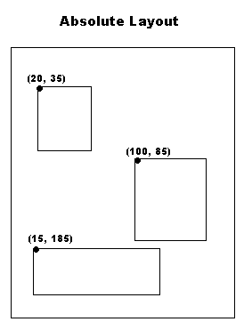

Los atributos especificos más importantes del absoluteLayout son 

| Atributo | Descripción                                         |
| -------- | --------------------------------------------------- |
| id       | Es el identificador único de un view o un viewGroup |
| layout_x | Especifíca la coordenada en x de la vista           |
| layout_y | Especifíca la coordenada en  de la vista            |

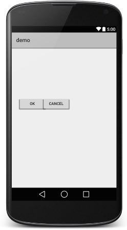

## Construyendo Layouts con Android Studio

## Bibliografía

* https://developer.android.com/guide/topics/ui/
* https://developer.android.com/reference/android/widget/LinearLayoout
* https://developer.android.com/guide/topics/ui/declaring-layout


https://www.tutorialspoint.com/android/android_user_interface_layouts.htm

https://developer.android.com/guide/topics/ui/layout/linear?hl=es-419

https://developer.android.com/reference/android/widget/LinearLayout.LayoutParams?hl=es-419#xml-attributes

https://www.xatakandroid.com/programacion-android/que-es-y-como-se-modifica-el-escalado-de-dpi-en-android

https://developer.android.com/guide/practices/screens_support?hl=es-419

https://www.tuexpertomovil.com/2015/03/27/que-es-la-densidad-de-pixeles-en-pantalla-y-como-se-nota-su-diferencia/

https://stackoverflow.com/questions/2025282/what-is-the-difference-between-px-dip-dp-and-sp

https://openwebinars.net/blog/diferencias-entre-px-dp-y-sp-en-android/

https://stackoverflow.com/questions/17382586/where-can-i-find-some-good-examples-of-android-ui

http://www.hermosaprogramacion.com/2015/08/tutorial-layouts-en-android/