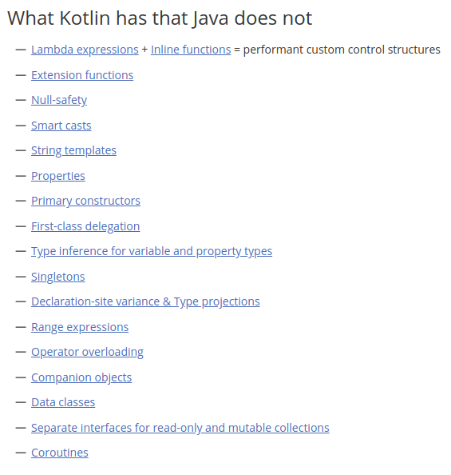

# Introducción a Kotlin


## Características principales de Kotlin

* Kotlin es open source
* Interoperable con Java
* Compila a java bytecode o a js
* Parámetros por defecto
* Null safety
* Permite escribir menos código
* Kotlin es como swift http://nilhcem.com/swift-is-like-kotlin/
* Los imports se hacen igual que en java solo que sin el `;`



## Compilación y ejecución desde linea de comandos

### Compilación 

```shell
kotlinc hello.kt -include-runtime -d hello.jar
```

### Ejecución

```she
java -jar hello.jar
```

## Hello, world!

Para imprimir tenemos las siguientes opciones

```kotlin
fun main(args:Array<String>){
    print("hello world")
    println("Hello world  with linebreak")
    val nombre = "Roy"
    println("Holi, "+nombre)
    println("holi, $nombre")
}
```

Para leer cadenas podríamos utilizar simplemente `readLine()`

## Variables y tipos de datos

### Var vs Val

#### Val

Crear una variable solo de lectura (constante)

```kotlin
val name = "Derek"
```

*¿Cuál es la salida del siguiente código?*

```kotlin
val b: Byte = 1 // OK, literals are checked statically
val i: Int = b // ERROR
//fixing using explict conversion
val i: Int = b.toInt() // OK: explicitly widened
print(i)
```

#### Var

Crear una variable que puede cambiar de valor

Kotlin usa la inferencia de tipos, pero también es posible definir el tipo

```kotlin
var myAge = 42 //correct
var myAge: Int = 50 //little less correct
```

```kotlin
// Doubles are normally precise to 15 digits
var dblNum1: Double = 1.11111111111111111
var dblNum2: Double = 1.11111111111111111

println("Sum : " + (dblNum1 + dblNum2))
println("Sum :  ${dblNum1 + dblNum2}")

// Characters are single quoted characters
var letterGrade: Char = 'A'
println("A is a Char : " + (letterGrade is Char))
```

### Null safety

El sistema de tipos de Kotlin tiene como objetivo eliminar las NullPointerException de nuestro código. Las únicas causas posibles de las NPE pueden ser:

- Una llamada explícita para lanzar NullPointerException ();
- Uso de la !! operador que se describe a continuación;
- Algunos datos inconsistentes con respecto a la inicialización, como cuando:
- Un no inicializado, este disponble en un constructor, se pasa y se usa en algún lugar ("esto se filtra");
- Un constructor de superclase llama a un miembro abierto cuya implementación en la clase derivada usa un estado no inicializado;
- Interoperación de Java:
  Intentos de acceder a un miembro en una referencia nula de un tipo de plataforma;
  Tipos genéricos utilizados para la interoperación de Java con nulabilidad incorrecta

De forma predeterminada, todos los objetos están a salvo de ser nulos, por lo que no aceptarán el valor nulo, pero hay escenarios en los que el valor podría ser nulo, por lo que, para esos casos explícitamente debe definirlos agregando `?`  según su tipo.

```kotlin
val str:String? = "name"
str = null
str.length //This will show error as ?. is not used may result in NPE.
str?.length //This is completely valid now.
str!!.length //This will produce NPE if str is null.
```

#### Safe Calls

```kotlin
val a = "Kotlin"
val b: String? = null
println(b?.length)
println(a?.length)
```

*Las llamadas seguras son útiles en las cadenas. Por ejemplo, si Bob, un Empleado, puede ser asignado a un Departamento (o no), a su vez puede tener a otro Empleado como jefe de departamento, para obtener el nombre del jefe de departamento de Bob (si corresponde), escribimos lo siguiente :*

```kotlin
bob?.department?.head?.name
```

#### Elvis Operator

Cuando tenemos una referencia n que puede contener nulos, podemos decir "si r no es nulo, utilícelo; de lo contrario, use un valor no nulo x":

```kotlin
val l: Int = if (b != null) b.length else -1
```

Junto con la expresión if completa, esto se puede expresar con el operador Elvis, escrito `?:`

```kotlin
val l = b?.length ?: -1

fun foo(node: Node): String? {
    val parent = node.getParent() ?: return null
    val name = node.getName() ?: throw IllegalArgumentException("name expected")
    // ...
}
```

#### The `!!` Operator

La tercera opción es para los amantes de NPE: el operador de aserción no-nulo (!!) convierte cualquier valor a un tipo que no sea nulo y lanza una excepción si el valor es nulo. Podemos escribir b !!, y esto devolverá un valor no nulo de b (por ejemplo, una cadena en nuestro ejemplo) o lanzar un NPE si b es nulo:

```kotlin
val l = b!!.length
```

### Casteos

```kotlin
println("3.14 to Int : " + (3.14.toInt()))
println("A to Int : " + (letterGrade.toInt()))
println("65 to Char : " + (65.toChar()))
```

#### Safe cast

Los cast regulares pueden resultar en una excepción ClassCastException si el objeto no es del tipo objetivo. Otra opción es usar conversiones seguras que devuelvan un valor nulo si el intento no tuvo éxito:

```kotlin
val aInt: Int? = a as? Int
```

### Operaciones con strings

```kotlin
// ----- STRINGS -----
// Strings are double quoted series of characters

val myName = "Derek Banas"

val longStr = """This is a
long string """

var fName = "Doug"
var lName = "Smith"

// You can combine strings
var fullName = fName + " " + lName

// You can use string interpolation
println("Name : $fullName")

// You can perform other operations with {}
println("1 + 2 = ${1 + 2}")

// Get length
println("String length : ${longStr.length}")

var str1 = "A random string"
var str2 = "a random string"

// Compare strings
println("Strings Equal : ${str1.equals(str2)}")

// Compare strings
// 0 : Equal, Negative if less, Positive if greater
println("Compare A to B : ${"A".compareTo("B")}")

// Get character at an index
println("2nd Index : ${str1.get(2)}")

// Get a substring from start up to but not including end
println("Index 2-7 : ${str1.subSequence(2,8)}")

// Checks if a string contains another
println("Contains random : ${str1.contains("random")}")
```

### Arreglos

En Kotlin, hay dos maneras principales de crear un arreglo: usando la función de ayuda `arrayOf()` o el constructor `Array()`.

#### La Función `arrayOf()`

Por ejemplo, creemos un arreglo con algunos elementos usando `arrayOf()`.

```kotlin
// You can store multiple types in arrays
	
val myArray0 = arrayOf(4, 5, 7, 3)
var myArray = arrayOf(1, 1.23, "Doug")
```

Para hacer cumplir que todos los valores del arreglo tienen el mismo tipo, ej. `Int`, declaramos un tipo llamando `arrayOf<Int>()` o `intArrayOf()`.

```kotlin
val myArray3 = arrayOf<Int>(4, 5, 7, 3, "Chike", false) // will not compile
val myArray4 = intArrayOf(4, 5, 7, 3, "Chike", false)  // will not compile
```

También tenemos otras funciones de utilidad para crear arreglos de otros tipos tales como `charArrayOf()`, `booleanArrayOf()`, `longArrayOf()`, `shortArrayOf()`, `byteArrayOf()`, y así por el estilo. Detrás de escenas, usar estas funciones creará un arreglo de sus respectivos tipos primitivos Java. 

#### El Constructor `Array()`

Ahora veamos cómo crear un arreglo con `Array()`. El constructor de esta clase requiere un tamaño y una función lambda. Aprenderemos más sobre funciones lambda después, pero por ahora, solo entiende que es una manera simple en línea de declarar una función anónima. En este caso, el trabajo de la función lambda es inicializar el arreglo con elementos.

```kotlin
val numbersArray = Array(5, { i -> i * 2 })
numbersArray.forEach { println(it) }
for (item in numbersArray){
    print(item) //print("item\n")
}
```

En el código de arriba, pasamos 5 como el tamaño del arreglo en el primer argumento. El segundo argumento toma una función lambda, la cuál toma el índice del elemento del arreglo y después devuelve el valor para ser insertado en ese índice en el arreglo. Así que en el ejemplo de arriba, creamos un arreglo con elementos 0, 2, 4, 6, y 8.

```kotlin
// ----- ARRAYS -----

// You can access values using indexes starting at 0
println(myArray[2])

// Change the value
myArray[1] = 3.14
println(myArray[1])

// numberElements in array
println("Array Length : ${myArray.size}")

// Is element in the array
println("Doug in Array : ${myArray.contains("Doug")}")

// Get first 2 elements in array as an array
var partArray = myArray.copyOfRange(0,1)

// Get the first element
println("First : ${str1.first()}")

// Get index of value
println("Doug Index : ${str1.indexOf("Doug")}")

// Create an array of squares
var sqArray = Array(5, { x -> x * x})
println(sqArray[2])

// There are type specific arrays
var arr2: Array<Int> = arrayOf(1,2,3)
println(arr2[2])
```


### Rangos

```kotlin
// ----- RANGES -----
// You define ranges by providing a starting and ending
// value

val oneTo10 = 1..10
val alpha = "A".."Z"

if (i in 1..10) { // equivalent of 1 <= i && i <= 10
    println(i)
}

for (i in 1..4) print(i)

for (i in 4..1) print(i)

for (i in 4 downTo 1) print(i)

for (i in 1..4 step 2) print(i)

for (i in 4 downTo 1 step 2) print(i)

for (i in 1 until 10) {
    // i in [1, 10), 10 is excluded
    println(i)
}
```

```kotlin
// Use in to search a Range
println("R in alpha : ${"R" in alpha}")

// Create ranges that decrement
val tenTo1 = 10.downTo(1)

// Create array up to a value
val twoTo20 = 2.rangeTo(20)

// Step through an array while adding 3
val rng3 = oneTo10.step(3)

// Cycle through a range and print
for(x in rng3) println("rng3 : $x")

// Reverse a range
for(x in tenTo1.reversed()) println("Reverse : $x")
```


## Estructuras de control

### Condicionales

#### if

```kotlin
// ----- CONDITIONALS -----
// Conditional Operators : >, <, >=, <=, ==, !=
// Logical Operators : &&, ||, !

val age = 8

if (age < 5){
	println("Go to Preschool")
} else if (age == 5){
	println("Go to Kindergarten")
} else if ((age > 5) && (age <= 17)){
	val grade = age - 5
	println("Go to Grade $grade")
} else {
	println("Go to College")
}
```

#### when

```kotlin
// When works like Switch in other languages
when (age) {

    // Match a list
    0,1,2,3,4 -> println("Go to Preschool")

    // Match a specific value
    5 -> println("Go to Kindergarten")

    // Match a range
    in 6..17 -> {
        val grade = age - 5
        println("Go to Grade $grade")
    }

    // Default
    else -> println("Go to College")
}
```

### Ciclos

#### for

```kotlin
// ----- LOOPING -----
// You can use for loops to cycle through arrays
// ranges, or anything else that implements the
// iterator function

for (x in 1..10){
	println("Loop : $x")
}

var arr3: Array<Int> = arrayOf(3,6,9)

// Iterate for indexes
for (i in arr3.indices){
    println("Mult 3 : ${arr3[i]}")
}

// Output indexes
for ((index, value) in arr3.withIndex()){
    println("Index : $index & Value : $value")
}
```

```kotlin
//Do this example as an exercise
for (x in 1..20){
    if (x % 2 == 0) {

        // Continue jumps back to the top of the loop
        continue
    }

    println("Odd : $x")

    // Break jumps out of the loop and stops looping
    if (x == 15) break

}
```


#### while

```kotlin
// Generate a random number from 1 to 50
val rand = Random()
val magicNum = rand.nextInt(50) + 1

// While loops while a condition is true
var guess = 0

while(magicNum != guess){
	guess += 1
}

println("Magic num is $magicNum and you guessed $guess")
```

## Particularidades del lenguaje

### ->

El `->` es parte de la sintaxis de kotlin y puede ser utilizado en tres contextos

- `when` expresiones donde separa la parte "coincidencia / condición" del bloque "resultado / ejecución"

  ```kotlin
   val greet = when(args[0]) {
     "Apple", "Orange" -> "fruit"
     is Number -> "How many?"
     else    -> "hi!"
   }
  ```

- lambda expressions donde separa los parametros del cuerpo de la funcion

  ```kotlin
    val lambda = { a:String -> "hi!" }
    items.filter { element -> element == "search"  }
  ```

- function types donde separa los tipos de parámetros del tipo de resultado e.g. `comparator`

  ```kotlin
  fun <T> sort(comparator:(T,T) -> Int){
  }
  ```

## Funciones

### Singles functions

```kotlin
// Functions start with fun, function name,
// parameters and return type

fun add(num1: Int, num2: Int) : Int = num1 + num2
println("5 + 4 = ${add(5,4)}")

// You don't need a return type with single line functions
// You can define default values for parameters
fun subtract(num1: Int = 1, num2: Int = 1) = num1 - num2
println("5 - 4 = ${subtract(5,4)}")
```

### Unit

```kotlin
// Use unit if you return nothing
fun sayHello(name: String) : Unit = println("Hello $name")
sayHello("Derek")
```

### Función + val

```kotlin
// We can define function literals
val multiply = {num1: Int, num2: Int -> num1 * num2}
println("5 * 3 = ${multiply(5,3)}")
```


### Default Parameters

La ausencia de esta función en java hace que el desarrollador agregue el concepto de sobrecarga de funciones, ya que el llamador debe pasar todo el parámetro declarado, pero con esta función puede deshacerse de todo esto simplemente al asignar el valor predeterminado al parámetro que desea.

```kotlin
fun argumentValid(num: Int, str: String = "12") {
}
//All 3 are valid
argumentValid(15, "Hey")
argumentValid(str = "Name", num = 45) //Named argument
argumentValid(45) //usage of default argument
```

### Adiós a los getters y setters

```kotlin
data class Student(internal val name:String, internal val age:Int){
    //something else ...
}
```

Accederemos a las propiedades de la clase de la siguiente forma

```kotlin
	var st= Student("mike",34)
	print(st.name) //internamente no estamos accediendo driectamente al atributo, en lugar de ello se crea un setter y getter solo que no los vemos explicitamente
```

### Funciones que regresan multiples valores

Hay escenarios en los que se debe devolver más de 1 valor desde la función, ahora es posible hacerlo. Esto se llama en realidad "declaración de desestructuración"".

```kotlin
data class Student(val name:String, val age:Int)
fun studentsFun(student: Student):Student {
    return Student(student.name, student.age)
}
val stud = Student("Jhon",24)
val (name,age) = studentsFun(stud)
println(name)
println(age)
```

### Pair class for 2 value return

```kotlin
// Returns 2 values
fun nextTwo(num: Int): Pair<Int, Int>{
    return Pair(num+1, num+2)
}
 // Functions can return 2 values with Pair and 3 with Triple
 val (two, three) = nextTwo(1)
 println("1 $two $three")

```

### Número de parámetro variables

```kotlin
// Receive variable number of parameters
fun getSum(vararg nums: Int): Int{
    var sum = 0
 
    // For each value in the array add it to sum
    nums.forEach { n -> sum += n }
 
    return sum
}

// Send a variable number of parameters
println("Sum : ${getSum(1,2,3,4,5)}")
```


### Extension functions

Como su nombre indica, esto agrega alguna funcionalidad adicional al componente existente.

```kotlin
fun Int.multi() = this * 5
print(50.multi()) //250

fun String.greet():String {
    return this.plus(" we welcome you!")
}
print("Jhon".greet())
```

### High order function

Si su función acepta la función como un parámetro o devuelve la función como resultado, se llama función de orden superior.

```kotlin
fun addValue(operation:(Int,Int) -> Int):Int {
    return operation(10,20)
}
/*Este es un ejemplo muy básico de la función de alto orden que acepta la función como un parámetro, aquí operation es el nombre de la función.*/

addValue{num1,num2 -> num1 * num2} //This will print 200
addValue{num1,num2 -> num1 - num2} //This will print -10
```

## Excepciones

```kotlin
// ----- EXCEPTION HANDLING -----
// Exceptions are handled just like with Java

val divisor = 2

try{
if (divisor == 0){
	throw IllegalArgumentException("Can't Divide by Zero")
} else {
	println("5 / $divisor = ${5/divisor}")
}

} catch (e: IllegalArgumentException){
	println("${e.message}")
}
```

## Clases

```kotlin
// ----- CLASSES -----
// Create an Animal object
val bowser = Animal("Bowser", 20.0, 13.5)

// Call method in the class
bowser.getInfo()

// ----- INHERITANCE -----
// Create a class Dog that inherits from
// the Animal class

val spot = Dog("Spot", 20.0, 14.5, "Paul Smith")

spot.getInfo()


// ----- INTERFACES -----
// Create a Bird object that implements the
// Flyable interface

val tweety = Bird("Tweety", true)

tweety.fly(10.0)
```

```kotlin
// ----- CLASSES -----
// There are no static methods
// Classes are final by default unless marked open
// The fields must also be marked as open
 
open class Animal (val name: String, var height: Double, var weight: Double){
 
    // Objects are initialized in init
    init {
 
        // Regex that matches for a number any place
        // in a string
        val regex = Regex(".*\\d+.*")
 
        // If these requirements aren't met an
        // IllegalArgumentException is thrown
        require(!name.matches(regex)) {"Animal Name can't Contain Numbers"}
 
        require(height > 0) {"Height must be greater then 0"}
 
        require(weight > 0) {"Weight must be greater then 0"}
 
    }
 
    // If you want to allow overriding of this method
    // you must use open
    open fun getInfo(): Unit{
        println("$name is $height tall and weighs $weight")
    }
}
 
// ----- INHERITANCE -----
class Dog(name: String,
          height: Double,
          weight: Double,
          var owner: String) : Animal(name, height, weight){
 
    // Overriding Animal method
    override fun getInfo(): Unit{
        println("$name is $height tall, weighs $weight and is owned by $owner")
    }
 
}
```

```kotlin
// ----- INTERFACES -----
// An interface is a contract that states all fields
// and methods a class must implement
 
interface Flyable {
    var flies: Boolean
 
    fun fly(distMiles: Double): Unit
}
 
// We override flies in the constructor
// To implement the interface we follow the
// constructor parameters with a colon and the
// interface name
class Bird constructor(val name: String, override var flies: Boolean = true) : Flyable{
 
    // We must also override any methods in the interface
    override fun fly(distMiles: Double): Unit{
        if(flies){
            println("$name flies $distMiles miles")
        }
    }
}
```

## Lo que nos faltó 😢 

- funciones lambda
- collections
- list
- maps

## Bibliografía

* https://kotlinexpertise.com/kotlin-features-miss-java/
* https://android.jlelse.eu/kotlin-best-features-a3facac4d6fd
* https://code.tutsplus.com/es/tutorials/kotlin-from-scratch-variables-basic-types-arrays-type-inference-and-comments--cms-29328
* http://www.newthinktank.com/2017/05/kotlin-tutorial/
* https://kotlinlang.org/docs/reference/classes.html