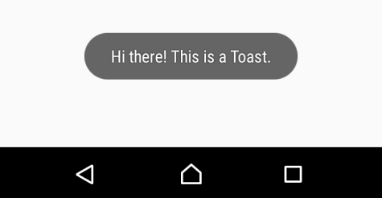

# Alertas

[TOC]

En ocasiones una aplicación requiere de enviar un mensaje al usuario. Para ello existen algunos métodos de comunicarse con el usuario de una manera sencilla y discreta.

## Toast

Una toast es una manera sencilla de brindar información sobre un proceso a través de una pequeña burbuja. Unicamente ocupa el espacio necesario para mostrar el mensaje además de no intervenir con la aplicación que se esté utilizando.





### Lo más básico

Primero se debe instanciar un objeto de la clase Toast, una vez creada, podemos hacer uso del método makeText(). Este método requiere de tres parámetros: El contexto de la aplicación, el mensaje que se va a mostrar y la duración de la notificación. Éste método regresara una Toast ya inicializada y lista para mostrarse con ayuda del método show().

Veamos como crear una toast utilizado Kotlin:

``` kotlin
val mensaje = "¡Hola!"
val duracion = Toast.LENGHT_SHORT

val toast = Toast.makeText(this, mensaje, duracion)
toast.show()
```


### Posicionando una toast

Normalmente, las toast aparecen centradas horizontalmente en la parte inferior de la pantalla. Podemos cambiar su posición utilizando el método setGravity(int c, int x, int y) .

## Cuadros de diálogos

Una ventana de diálogo, además de mostrar información como una toast, nos permite interactuar con el usuario permitiendolé tomar una decisión o ingresar información adicional. 
Para poder trabajar con estos cuadros de diálogo haremos uso de la clase Dialog, que es la clase base para crearlos. 

### Subclases AlertDialog y DatePickerDialog

AlertDialog: Se trata de un dialogo que puede mostrar un título, hasta tres botones, una lista de elementos seleccionables o un diseño personalizado.

DatePickerDialog: También conocida como TimerPickerDialog, se trata de un dialogo con una  IU predefinida que le permite al usuario seleccionar una fecha u hora.


### La clase DialogFragment

Esta clase proporciona todos los controles que necesitan para crear un diálogo. Además, nos permite administrar el aspecto del mísmo.

Veamos un ejemplo de un AlertDialog dentro de un DialogFragment con Java:

``` java
public class FireMissilesDialogFragment extends DialogFragment{
    @Override
    public Dialog onCreateDialog(Bundle savedInstanceState){
        AlertDialog.Builder builder = new AlertDialog.Builder(getActivity());
        builder.setMessage(R.string.fire, new DialogInterface.OnClickListenner(){
            public void onClick(DialogInterface dialog, int id){
                //Fuego a discresión v:
            }
        })
            .setNegativeButton(R.string.cancel, new DialogInterface.OnClickListener(){
                public void onClick(DialogInterface dialog, int id){
                    //Alto al fuego
                }
            });
        return builder.create()  //Se ha creado el dialogo de alerta y se regresa
    }
}
```

